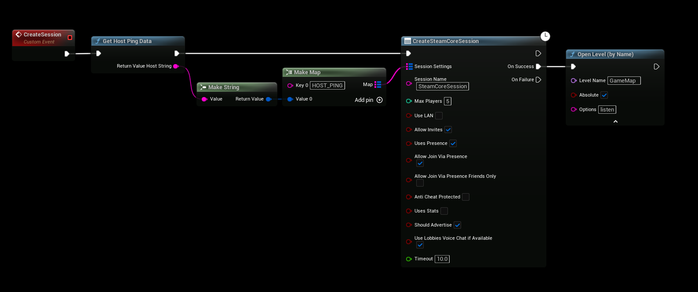

# Ping SteamCore Sessions

:::tip TIP
You must use SteamSockets netdriver to use this functionality
:::

# CREATING THE SESSION

You create a SteamCore session like usual but we’re going to add a custom attribute that contains our host ping data so that steam knows where to get it’s ping data from.

We must wait until the ping calculation is done, this is usually done when starting up the application but in rare cases it may take longer so we have to be sure it’s done calculating, then we get our host ping data and pass that in as an attribute string when creating the session.

# GETTING THE PING VALUE

Getting the ping value from the session is just as simple, all we have to do is call “Find SteamCore Sessions” and get the host ping value from the sessions attributes and use that to get the ping value, here is an example.

